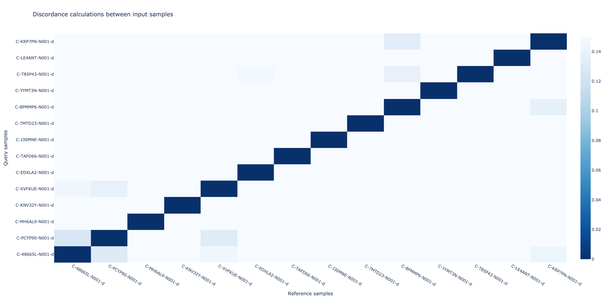

# Genotype
Compares each sample against each other to verify expected sample matches and identify any unexpected matches or mismatches. Running these comparisons requires the extracted pileup information to compute a discordance score between each pair of samples. The documentation below details the different ways to run this analysis, the output, and the methods behind them.

### How to run the tool
You need one or more samples to run this analysis. However, if you supply just one sample then it is assumed you have samples already in the database to compare with. There are two required inputs: (1) the names of the sample(s) you want to compare (referred to as `input samples` below), and (2) the database (biometrics will automatically load all sample data from the database). Moreover, there are two types of comparisons that are performed when running the tool:

##### (1) Compares your input samples with each other
This only runs if you supplied two or more input samples. The easiest way to indicate which samples you want to compare is to give the sample names via the `--sample-name` flag. Below is an example command:

```shell
biometrics genotype \
  -sn C-48665L-N001-d C-PCYP90-N001-d C-MH6AL9-N001-d \
  -db /path/to/store/extract/output
```

You can also indicate your input samples via a CSV file, which has the same format as what you provided to the extraction tool, but you only need the `sample_name` column:

```shell
biometrics genotype \
  -i samples.csv \
  -db /path/to/store/extract/output
```

##### (2) Compares your input samples with remaining database samples
The second analysis will compare each of your input samples with all remaining samples in the database. However, if you wish to disable this step and not do the comparison then you can supply the `--no-db-compare` flag:

```shell
biometrics genotype \
  -sn C-48665L-N001-d C-PCYP90-N001-d C-MH6AL9-N001-d \
  --no-db-compare \
  -db /path/to/store/extract/output
```

### Output

All analyses output a CSV file containing the metrics from comparing each sample. An interactive heatmap can also optionally be produced by supplying the `--plot` flag. These outputs are saved either to the current working directory or to a folder you specify via `--outdir`.


It also automatically outputs two sets of clustering results: (1) the first set just clusters your input samples, and (2) the second set clusters your input samples and samples in the database. Please see the [cluster](cluster.md) documentation to understand the output files.


##### CSV files

###### genotype_comparison.csv
Contains metrics for each pair of samples compared (one on each line). The table below provides a description on each column.

| Column Name | Description |
| :--- | :--- |
| ReferenceSample | First sample in the comparison. |
| ReferenceSampleGroup | Group for the first sample in the comparison. |
| QuerySample | Second sample in the comparison. |
| QuerySampleGroup | Group for the second sample in the comparison. |
| CountOfCommonSites | Count of common SNP sites with enough coverage. |
| HomozygousInRef | Number of homozygous sites in the ReferenceSample. |
| TotalMatch | Total sites that match (homozygous and heterozygous). |
| HomozygousMatch | Number of homozygous sites that match. |
| HeterozygousMatch | Number of heterozygous sites that match. |
| HomozygousMismatch | Number of mismatching homozygous sites. |
| HeterozygousMismatch | Number of mismatching heterozygous sites. |
| DiscordanceRate | Discordance rate metric. |
| Matched | True if ReferenceSample and QuerySample have DiscordanceRate less than the threshold (default 0.05). |
| ExpectedMatch | True if the sample pair is expected to match. |
| Status | Takes one of the following: Expected Match, Unexpected Match, Unexpected Mismatch, or Expected Mismatch. |

##### Interactive plot

Below are the two figures that are outputted from the two types of comparisons that are done. Samples that are unexpected matches or mismatches will be marked with a red star in the heatmap.



### Algorithm details

Any samples with a discordance rate of 5% or higher are considered mismatches.

$$
Discordance\ Rate = \frac{Number\ of\ matching\ homozygous\ SNPs\ in\ Reference\ but\ not\ Query}{Number\ of\ homozygous\ SNPs\ in\ Reference}\\
$$


If there are <10 common homozygous sites, the discordance rate can not be calculated since this is a strong indication that coverage is too low and the samples failed other QC.

