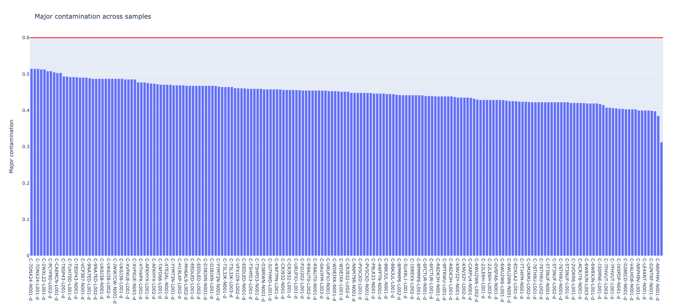

# Major contamination

Major contamination is a metric to see if a sample is contaminated with small amounts of DNA from another unrelated sample. The metric requires the extracted pileup information from running the `extract` tool.

## How to run the tool

You can run this tool with one or more samples. There are three ways you can provide the input to the `--input` flag:

#### Method 1

You can provide the sample names. This assumes there is a file named `{sample_name}.pk` in the database directory.

```text
biometrics major \
  -i C-48665L-N001-d -i C-PCYP90-N001-d -i C-MH6AL9-N001-d \
  -db /path/to/extract/output
```

#### Method 2
You can directly provide it the python pickle file that was outputted from the `extract` tool.

```text
biometrics major \
  -i /path/to/extract/output/C-48665L-N001-d.pk \
  -i /path/to/extract/output/C-PCYP90-N001-d.pk \
  -i /path/to/extract/output/C-MH6AL9-N001-d.pk \
```

#### Method 3
You can also indicate your input samples via a CSV file, which has the same format as what you provided to the extraction tool, but you only need the `sample_name` column:

```text
biometrics major \
  -i samples.csv \
  -db /path/to/store/extract/output
```

## Output

All analyses output a CSV file containing the metrics for each sample. An interactive bar graph can also optionally be produced by supplying the `--plot` flag. These outputs are saved either to the current working directory or to a folder you specify via `--outdir`.

### CSV file

The CSV file contains metrics for each pair of samples compared \(one per line\). The table below describes each column in the CSV output:

| Column Name | Description |
| :--- | :--- |
| sample\_name | Sample name. |
| sample\_group | Sample group \(if available\). |
| sample\_sex | Sample sex \(if available\). |
| sample\_type | Sample type \(if available\). |
| total\_sites | Total number of sites. |
| total\_heterozygous\_sites | Total number of heterozygous sites. |
| major\_contamination | Major contamination metric. |

### Interactive plot

Below is an example bar plot showing the per-sample major contamination metrics. You can hover over each bar to get more information about the sample. You can also control the major contamination threshold \(the horizontal red line\) via the `--major-threshold` flag.



## Algorithm details

Major contamination is calculated as the number of heterozygous sites divided by the total number of sites. A heterozygous site is defined as one with &gt; 10% minor allele frequency.
