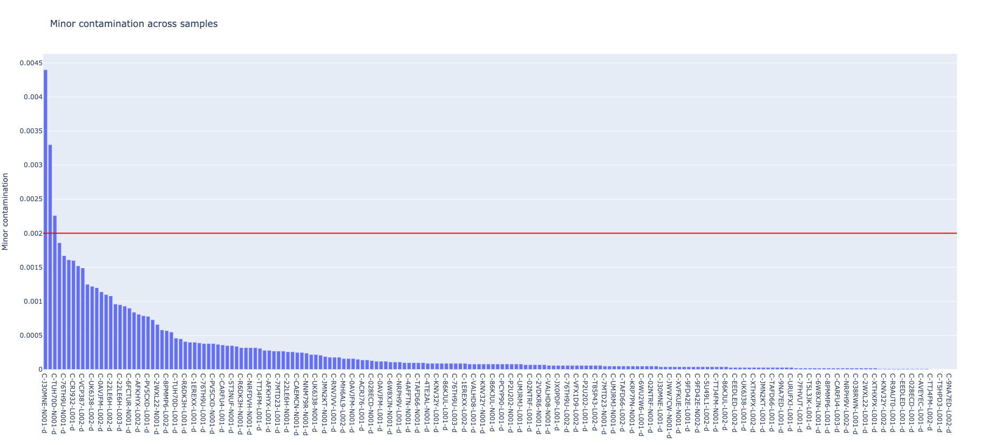

# Minor contamination
Minor contamination is a metric to see if a sample is contaminated with small amounts of DNA from another unrelated sample. The metric requires the extracted pileup information from running the `extract` tool.

### How to run the tool
You can run this tool with one or more samples. The two required inputs are the list of sample names and the database (biometrics will automatically load all sample data from the database). Below is an example command:

```shell
biometrics minor \
  -sn C-48665L-N001-d C-PCYP90-N001-d C-MH6AL9-N001-d \
  -db /path/to/store/extract/output
```

You can also indicate your input samples via a CSV file, which has the same format as what you provided to the extraction tool, but you only need the `sample_name` column:

```shell
biometrics minor \
  -i samples.csv \
  -db /path/to/store/extract/output
```

### Output

All analyses output a CSV file containing the metrics for each sample. An interactive bar graph can also optionally be produced by supplying the `--plot` flag. These outputs are saved either to the current working directory or to a folder you specify via `--outdir`.

##### CSV file
The CSV file contains metrics for each pair of samples compared (one per line). The table below describes each column in the CSV output:

| Column Name | Description |
| :--- | :--- |
| sample_name | Sample name. |
| sample_group | Sample group (if available). |
| sample_sex | Sample sex (if available). |
| sample_type | Sample type (if available). |
| total_homozygous_sites | Total number of homozygous sites. |
| minor_contamination | Minor contamination metric. |


##### Interactive plot
Two interactive plots are produced that help you further investigate the data.


The sample order is the same between the two plots.



You can also control the minor contamination threshold (the horizontal red line) via the `--minor-threshold` flag.


###### Minor contamination plot

Shows the minor contamination for each sample, ranked from highest to lowest. You can hover over each bar to get more information about the sample.



###### Contributing sites plot

Shows statistics for each site that contributes to the minor contamination calculation. Only sites with a minor allele frequency > 0 are shown. You can hover over each point to get more information about that site.


### Algorithm details

Minor contamination is calculated as the average minor allele frequency for homozygous sites. A homozygous site is defined as one with < 10% minor allele frequency.
